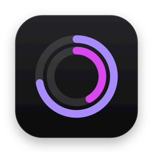
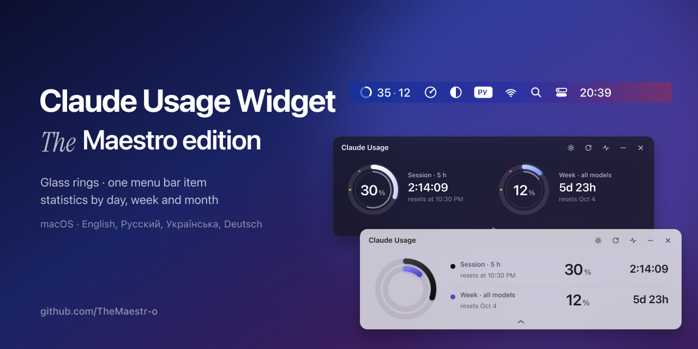
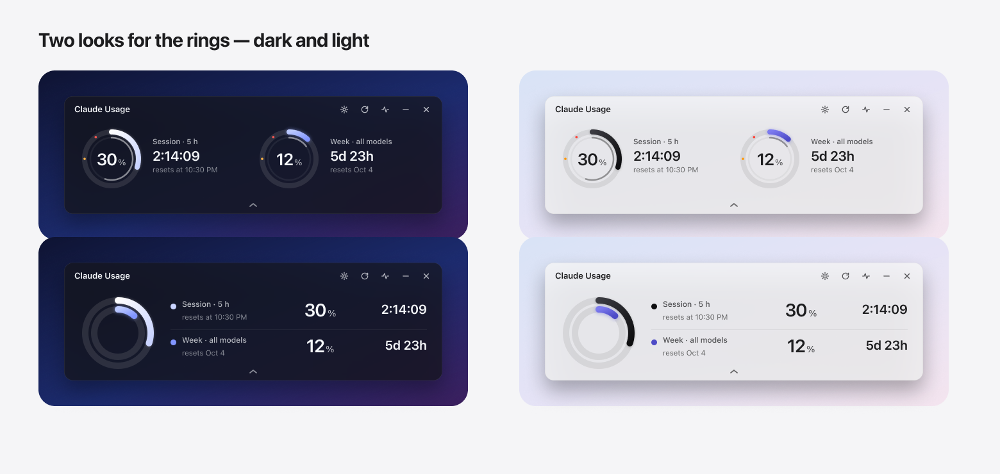
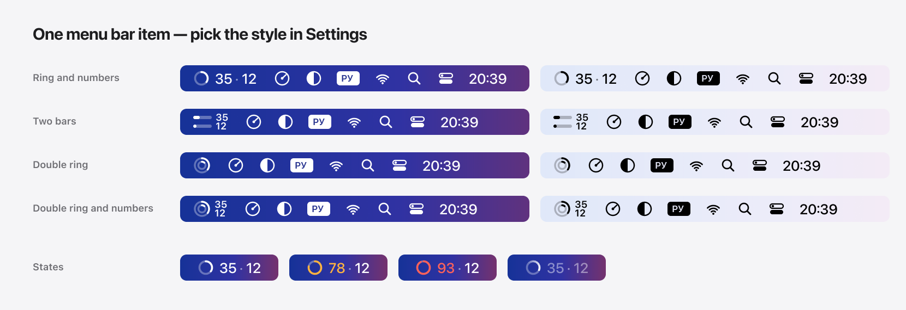
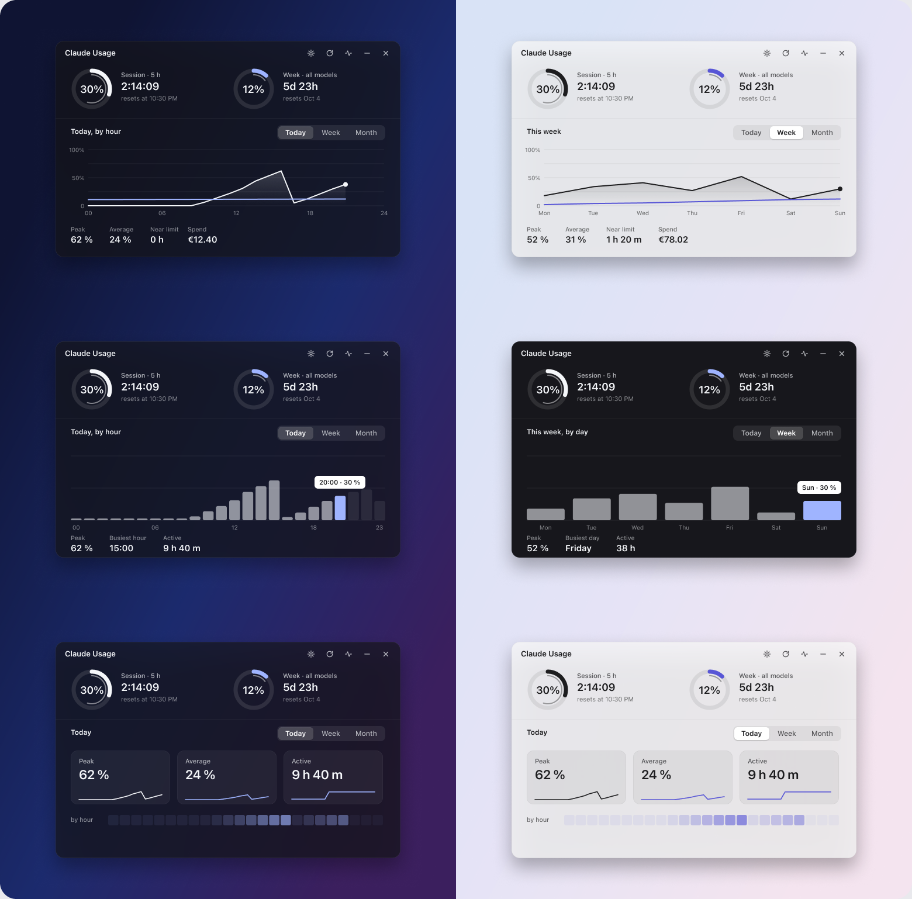
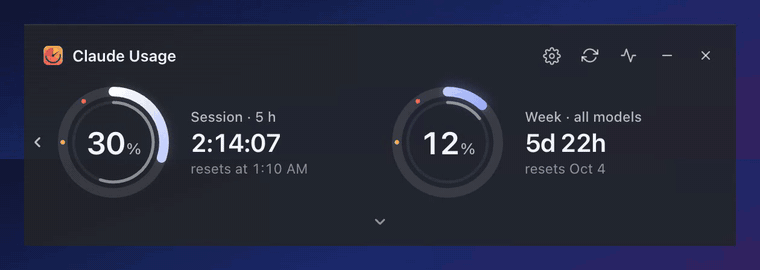
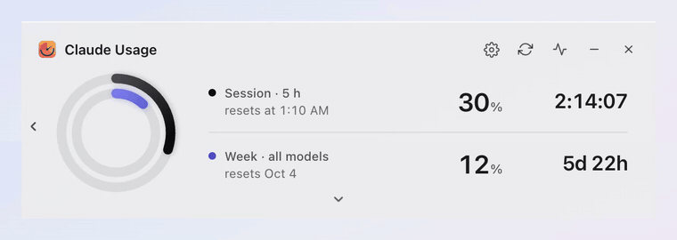

<p align="center"></p>

# Claude Usage Widget — *The* Maestro edition

A redesigned macOS build of [Claude Usage Widget](https://github.com/SlavomirDurej/claude-usage-widget) by **Slavomir Durej** (MIT), reworked by **[The Maestro](https://github.com/TheMaestr-o)**: glass rings, one menu bar item, statistics by day / week / month, a white-glass light theme and a smooth refresh. Unofficial — not by Anthropic.

<p align="center"><a href="https://github.com/TheMaestr-o/claude-usage-widget/releases/latest"></a></p>

<p align="center"><a href="https://github.com/TheMaestr-o/claude-usage-widget/releases/latest"><b>Download for macOS (Apple Silicon)</b></a> · <a href="https://paypal.me/ohnedan">Support The Maestro</a></p>

## What this edition adds

- **Rings, two looks.** Two rings side by side, or one ring inside the other (Apple Watch style). Soft gradient arcs, threshold marks on the track, amber at 75 %, red at 90 %.
- **One menu bar item.** Both numbers in a single item that looks like the system's own icons and adapts to a light or dark menu bar; colour only at the thresholds. Four styles to pick in Settings.
- **Statistics you choose.** Today · Week · Month switch, three looks — line, bars, summary cards — with peak, average, time near the limit and spend. History is kept for 32 days.
- **Light theme as white glass.** The window material follows the theme, every text keeps at least 4.5 : 1 contrast.
- **Smooth refresh.** One continuous movement: the arc gathers into a comet, circles, and lands on the new value at twelve o'clock.
- **Four languages.** English (default), Русский, Українська, Deutsch.







<p align="center"><br></p>

## Install

Download the `.dmg` from [Releases](../../releases), drag the app to Applications. The build is not notarized: on first launch right-click the app → **Open**. macOS may ask once for access to the app's own keychain item — choose **Always Allow**.

## Support

If this edition is useful to you — [buy The Maestro a coffee](https://paypal.me/ohnedan). The original author can be supported [here](https://paypal.me/SlavomirDurej).

## Also included

- Session and weekly limits with live countdowns and reset times
- Per-model rows (Sonnet, Opus, Fable, Cowork, Design, OAuth apps) when your account reports them
- Monthly spend cap and credit balance, promo and purchased credits shown apart
- Notifications at your warning thresholds
- Compact view, always on top, launch at login
- 12/24-hour time and date formats
- Encrypted credential storage; talks only to claude.ai
- Separate accounts side by side with `--profile=<name>`

## First launch

1. Open the app and choose **Log in** — a Claude.ai window opens.
2. Sign in; the widget picks up the session and shows your limits.
3. If the login window is blocked, choose **Manual** and paste your `sessionKey` cookie.

**Controls:** drag the title bar to move · refresh · usage statistics · minimise · close. The menu bar item opens a menu with Show, Refresh, Log out and Quit.

## Build from source

Requires Node.js 18+.

```bash
git clone https://github.com/TheMaestr-o/claude-usage-widget.git
cd claude-usage-widget
npm install
npm start
```

## Troubleshooting

- **Keeps asking to log in** — the session expired; log in again.
- **Numbers don't change** — check the connection and press refresh.
- **"Damaged or can't be opened"** — run `xattr -cr /Applications/Claude-Usage-Widget.app` and open it again.

## Privacy

Credentials stay on your Mac in encrypted storage. No data goes anywhere except the official Claude.ai API. Logging out clears the session, cookies and storage.

## Credits

Original widget by [Slavomir Durej](https://github.com/SlavomirDurej/claude-usage-widget), with contributions from [@cwil2072](https://github.com/cwil2072), [@dion-jy](https://github.com/dion-jy), [@goooseman](https://github.com/goooseman) and [@sergkuzn](https://github.com/sergkuzn). Windows and Linux builds are available in the original project.

The Maestro edition — design and development by [The Maestro](https://github.com/TheMaestr-o).

## License

[MIT](LICENSE). Unofficial — not by Anthropic.
